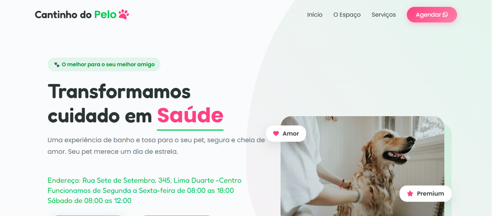

Cantinho do Pelo | Pet Shop & Banho e Tosa
📸 Preview do Projeto

Site institucional desenvolvido para um Pet Shop especializado em banho e tosa, com foco em identidade visual, apresentação dos serviços e contato direto com o cliente.
O projeto tem como objetivo fortalecer a presença digital do negócio e transmitir confiança, carinho e profissionalismo desde o primeiro acesso.

🎯 Objetivo do Projeto

Criar uma página simples, moderna e responsiva para:

Apresentar o canal no YouTube

Direcionar o público para os vídeos

Fortalecer a identidade visual do criador de conteúdo

Facilitar o acesso em dispositivos móveis

🚀 Tecnologias Utilizadas

HTML5

CSS3

JavaScript

Bootstrap

javascript

Git e GitHub

📱 Características do Projeto

Layout totalmente responsivo

Design limpo e direto

Estrutura focada em conversão e engajamento

# Clone o repositório git clone
https://diogo-netto.github.io/Pet-Shop/

Navegação simples e intuitiva

Projeto real em produção
